# Mini EV Twin 🚗⚡

Python-Based Digital Twin for Electric Vehicle Simulation

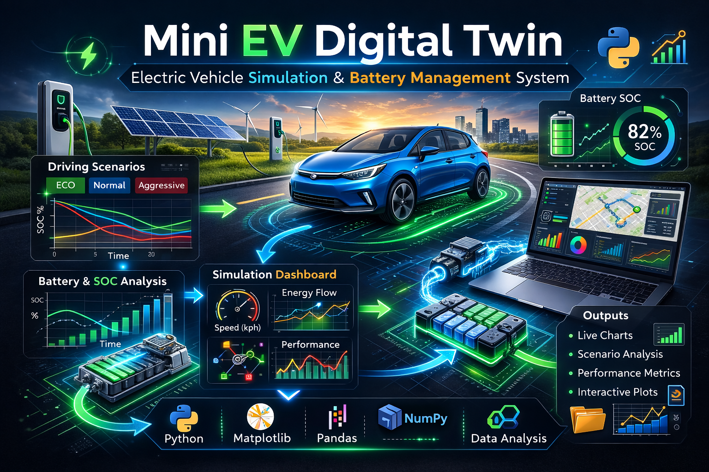


---

## Project Overview

Mini EV Twin is a Python-based simulation project that demonstrates a simplified **Digital Twin concept for Electric Vehicles (EVs)**.

The system models how an electric vehicle behaves under different conditions such as:

* Driver style
* Road slope
* Traffic resistance
* Battery health

The project performs multi-scenario simulations and produces engineering dashboards, KPI visualizations, scenario analysis, and animated vehicle behavior.

This project was built as a self-initiated **portfolio engineering project** combining:

* EV simulation
* data analysis
* visualization
* digital twin concepts

---

## Main Features

* EV longitudinal motion simulation
* Driver behavior modeling (**Eco / Normal / Aggressive**)
* Battery state-of-charge (SOC) simulation
* Traffic resistance modeling
* Road slope modeling
* Battery health modeling (**Healthy / Aged**)
* Scenario-based simulation analysis
* CSV data export for data analysis
* Advanced engineering visualization
* KPI dashboards
* Multi-scenario animated vehicle simulation

---

## Technologies Used

### Programming Language

* Python

### Python Libraries

* numpy
* pandas
* matplotlib
* csv
* os

### Development Tools

* VS Code
* GitHub

---

## Project Structure

```text
Mini EV Twin
│
├── results
│
├── assets
│
├── main.py
├── simulation_engine.py
├── vehicle_model.py
├── battery_model.py
├── driver_model.py
├── environment_model.py
│
├── analysis.py
├── advanced_visualization.py
├── summary_dashboard.py
├── multi_animation.py
│
├── plotter.py
├── config.py
│
└── README.md
```

---

## System Architecture

The Mini EV Twin simulation system is composed of multiple interacting modules that model the behavior of an electric vehicle under different conditions.

The architecture of the system is illustrated below.

```text
        Driver Model
             │
             ▼
      Environment Model
             │
             ▼
        Vehicle Model
             │
             ▼
        Battery Model
             │
             ▼
      Simulation Engine
             │
             ▼
      Data Analysis
             │
             ▼
        Visualization
```

---

## Simulation Workflow

The Mini EV Twin simulation follows a multi-stage pipeline where different vehicle and environment parameters are combined to simulate electric vehicle behavior.

```text
Define Scenario
   │
   ▼
Driver Behavior Model
(Eco / Normal / Aggressive)
   │
   ▼
Environment Conditions
(Road Slope / Traffic Resistance)
   │
   ▼
Vehicle Dynamics Simulation
   │
   ▼
Battery & SOC Modeling
   │
   ▼
Simulation Engine
   │
   ▼
Data Export (CSV Results)
   │
   ▼
Data Analysis
   │
   ▼
Visualization & Dashboards
   │
   ▼
Animated EV Simulation
```

---

## Project Highlights

This project demonstrates several key engineering concepts related to electric vehicle modeling and digital twin systems.

**Key highlights of the project include:**

* Simulation of electric vehicle longitudinal dynamics
* Modeling different **driver behaviors** (Eco / Normal / Aggressive)
* Integration of **environmental factors** such as road slope and traffic resistance
* Battery **state-of-charge (SOC)** modeling
* Multi-scenario simulation analysis
* Export of simulation data for further analysis
* Generation of engineering **dashboards and KPI metrics**
* Visualization of simulation results using Python
* Animated representation of the EV digital twin behavior

This project demonstrates how simulation, data analysis and visualization can be combined to build a simplified **digital twin framework for electric vehicles**.

---

## Project Visualization

The simulation generates multiple engineering dashboards and scenario analysis plots.

---

### Vehicle Behavior Simulation

Speed, battery SOC, power consumption and position evolution during a simulation run.

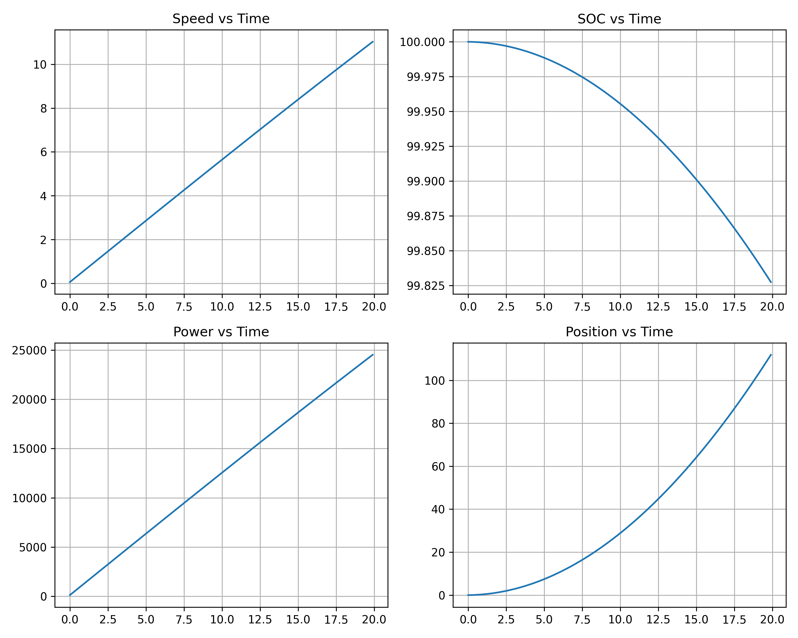

---

### Battery Health Comparison

Comparison between **Healthy** and **Aged** battery performance.

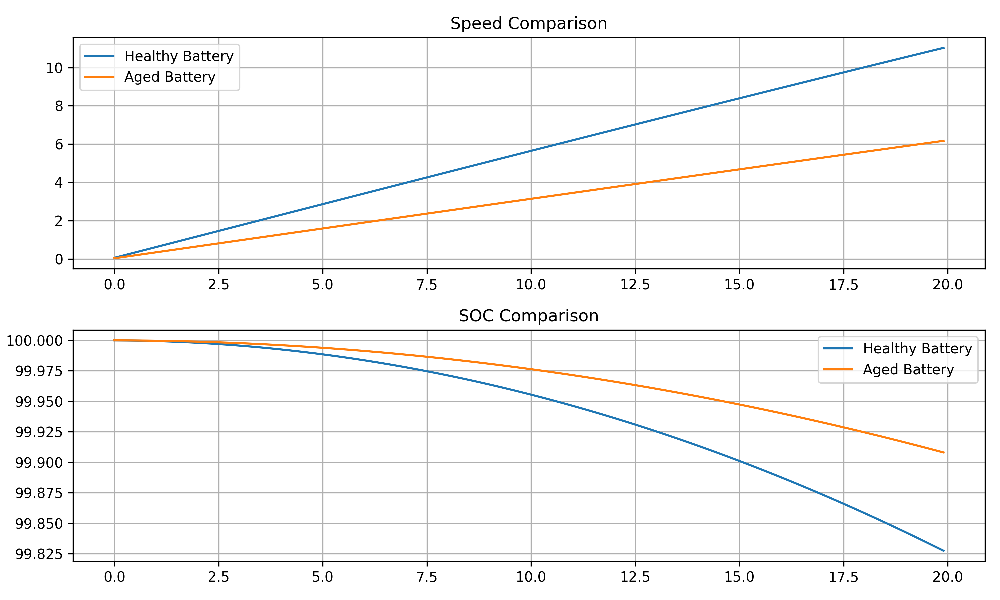

---

### Scenario Sweep – Healthy Battery

Simulation results across different driver styles, road slopes and traffic conditions.

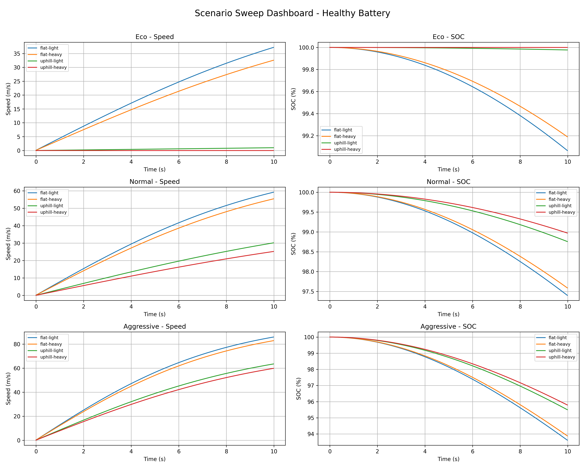

---

### Scenario Sweep – Aged Battery

Simulation results for an aged battery under the same scenario combinations.

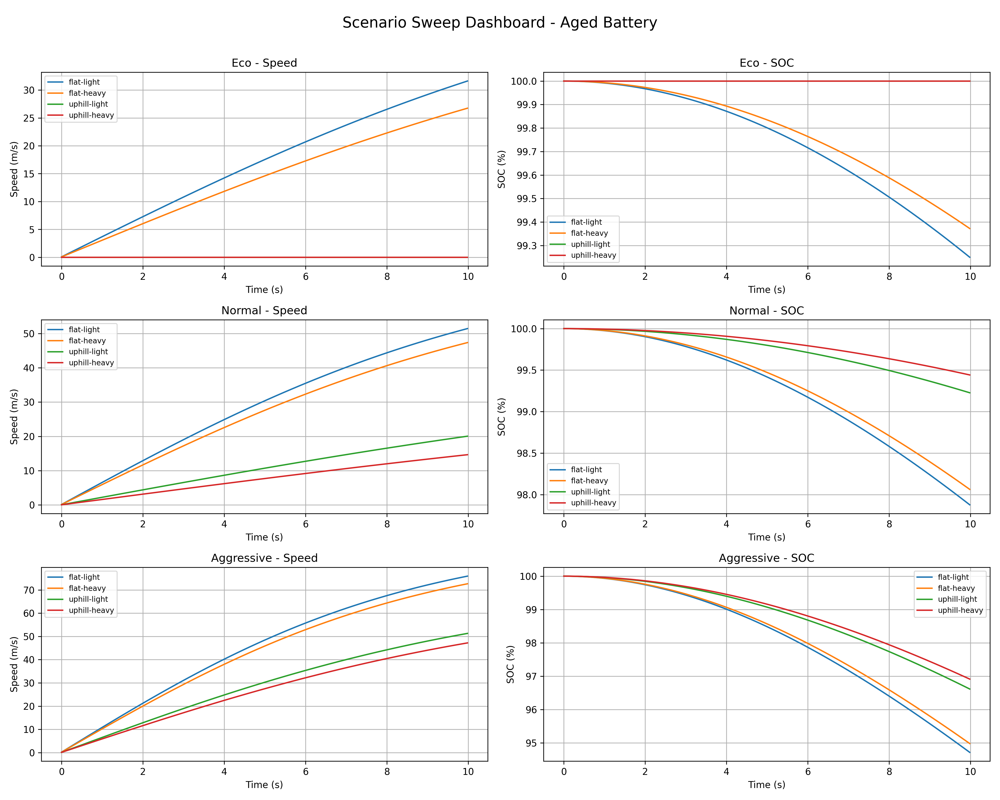

---

### Driver Style vs Maximum Speed

How driving behavior affects vehicle performance.

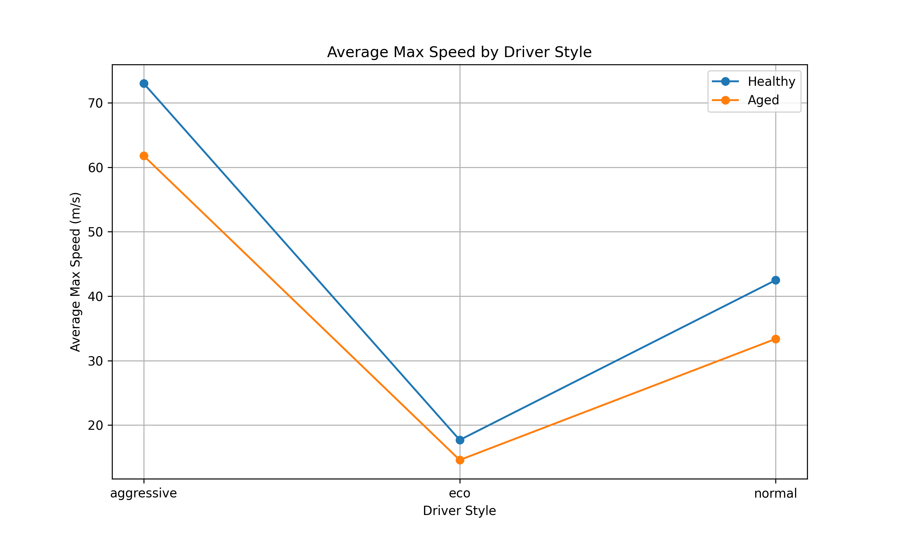

---

### Driver Style vs Battery Consumption

Impact of driving behavior on **battery SOC drop**.

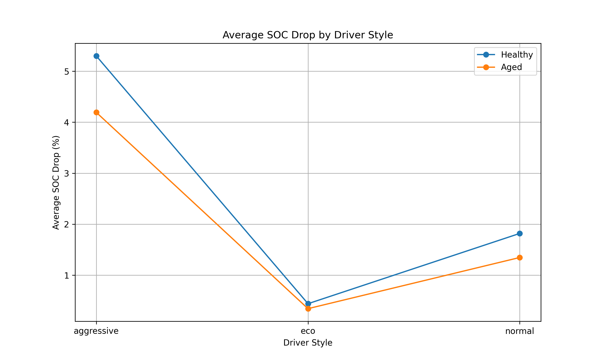

---

### Road Type Impact on Vehicle Speed

Effect of **flat vs uphill roads** on final vehicle speed.

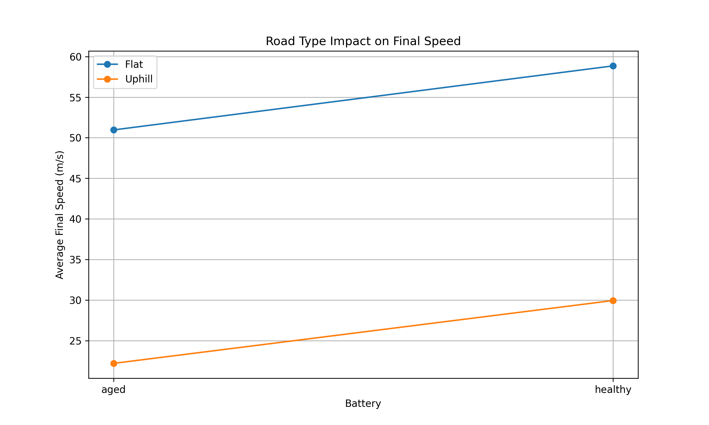

---

### Traffic Impact on Battery Consumption

Impact of traffic resistance on battery usage.

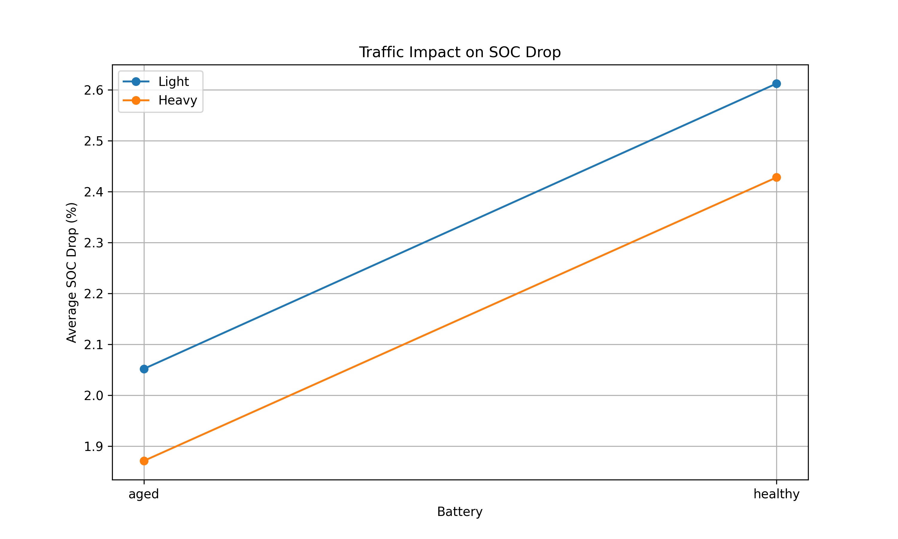

---

### Battery Health Impact on Maximum Speed

Healthy vs aged battery influence on vehicle performance.

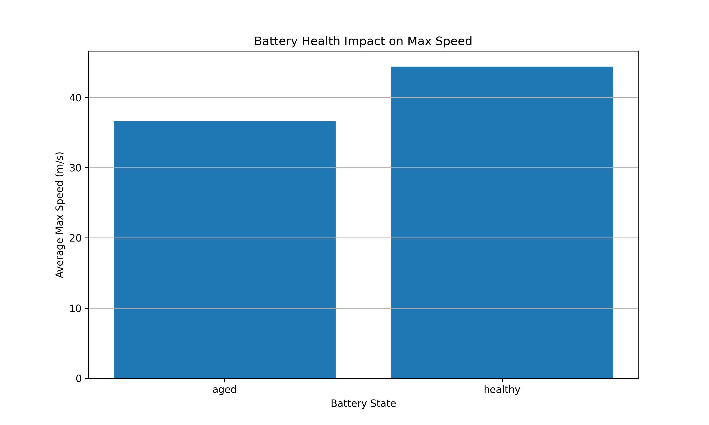

---

### Top 10 Worst Scenarios by Battery Consumption

Ranking of the scenarios with the highest SOC drop.

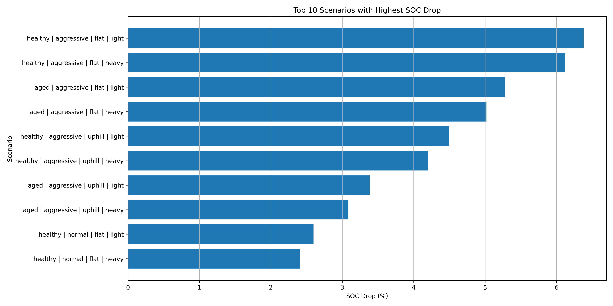

---

### Summary Dashboard

Overview of all simulation results.

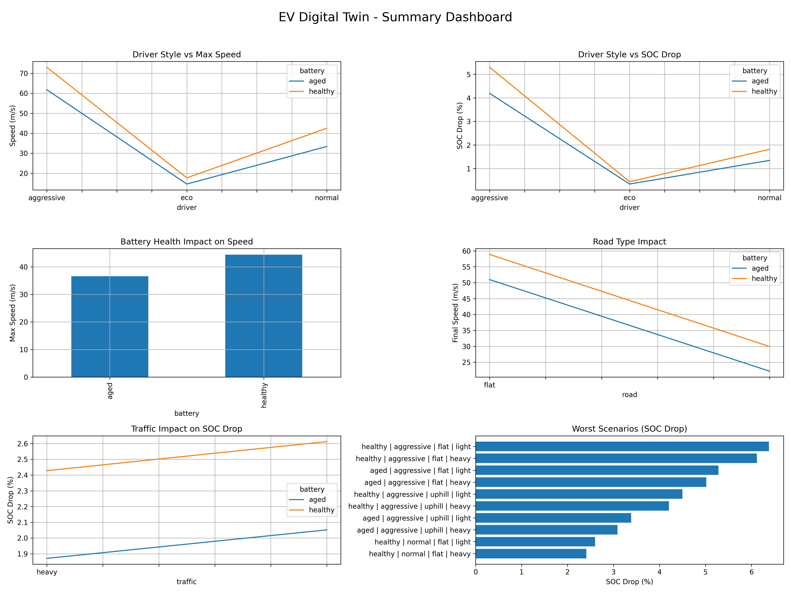

---

### KPI Dashboard

Engineering KPI summary of the simulation system.

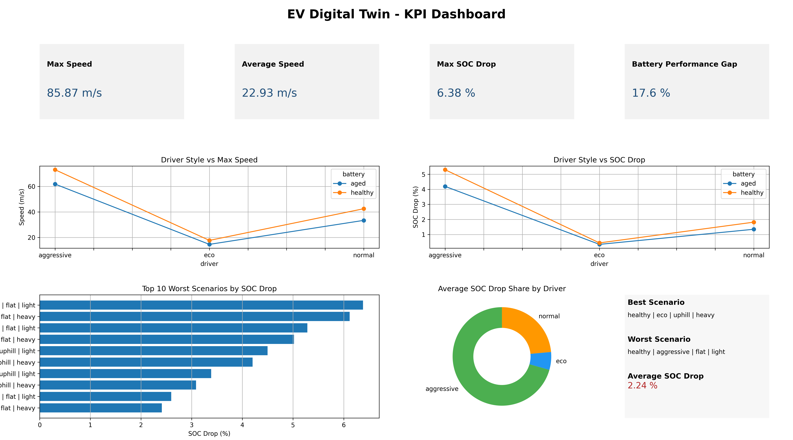

---

### Scenario KPI Cards

Detailed scenario-level metrics.

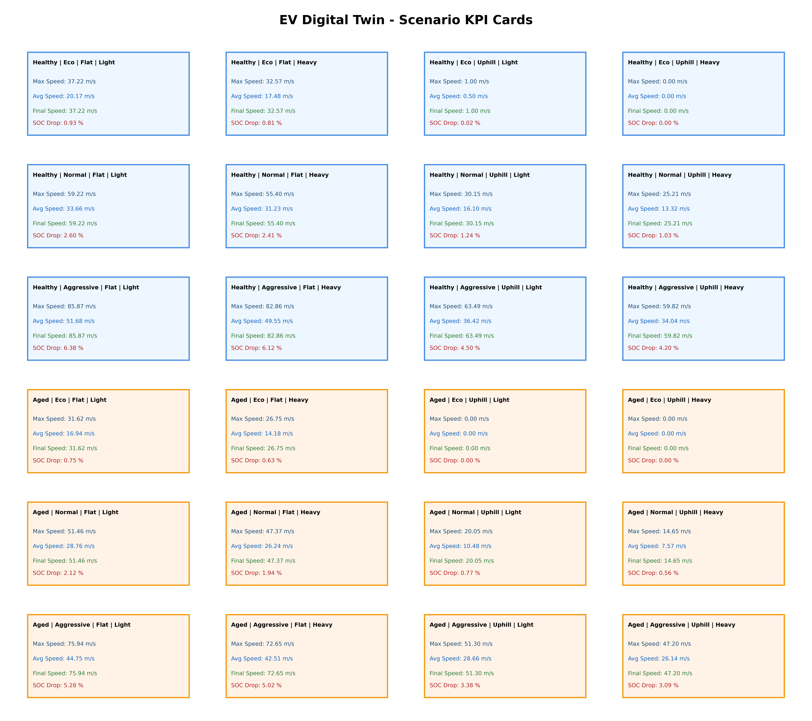

---

## Engineering Insights

The simulation results provide several engineering insights into electric vehicle behavior under different driving conditions.

### Driver Behavior Impact

Aggressive driving significantly increases battery consumption and leads to a faster drop in State of Charge (SOC).  
Eco driving mode provides the most energy-efficient operation.

### Battery Health Impact

Vehicles with aged batteries experience:

* Reduced maximum speed
* Faster SOC depletion
* Lower overall performance

### Road Slope Impact

Uphill road conditions increase the power demand of the vehicle and reduce the achievable speed compared to flat road scenarios.

### Traffic Resistance Impact

Higher traffic resistance increases energy consumption and reduces driving efficiency.

### Scenario Analysis

The scenario sweep simulation demonstrates how combinations of driver behavior, road conditions, traffic resistance, and battery health influence the overall vehicle performance.

These insights illustrate how simulation models can be used to evaluate vehicle efficiency and support engineering decision-making in electric mobility systems.

---

## Simulation Animation

Click the preview image below to watch the animated EV digital twin simulation.

[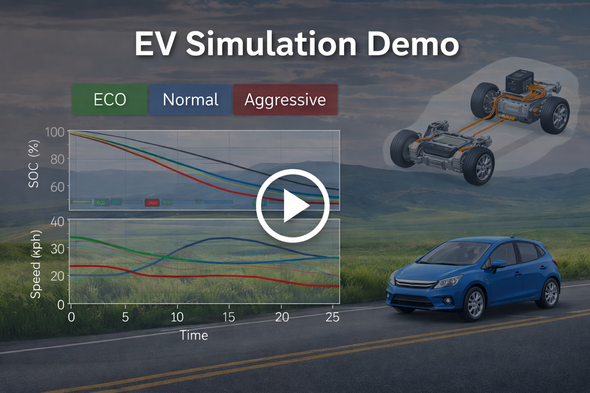](https://github.com/AminEbrahimi031/mini-EV-Digital-Twin/raw/main/demo/ev_simulation_demo.mp4)

---

## Future Work

The current project represents a simplified digital twin concept for electric vehicles.  
Several extensions could further improve the realism and capabilities of the simulation.

Possible future improvements include:

* Real-time digital twin simulation
* Integration with traffic simulators such as **SUMO**
* Integration with autonomous driving simulators such as **CARLA**
* Machine learning based driver behavior modeling
* Reinforcement learning for energy-efficient driving strategies
* Real vehicle telemetry integration
* Interactive dashboards using web-based visualization tools
* Advanced battery thermal modeling

These extensions could transform the Mini EV Twin into a more advanced research platform for electric mobility simulation.

---

## Author

Amin Ebrahimi

Background:  
Electrical Engineering (Control Systems)

Current field:  
Digital Technologies

Areas of interest:

* Electric Vehicles
* Digital Twins
* Simulation
* Mobility Systems
* Data Analysis